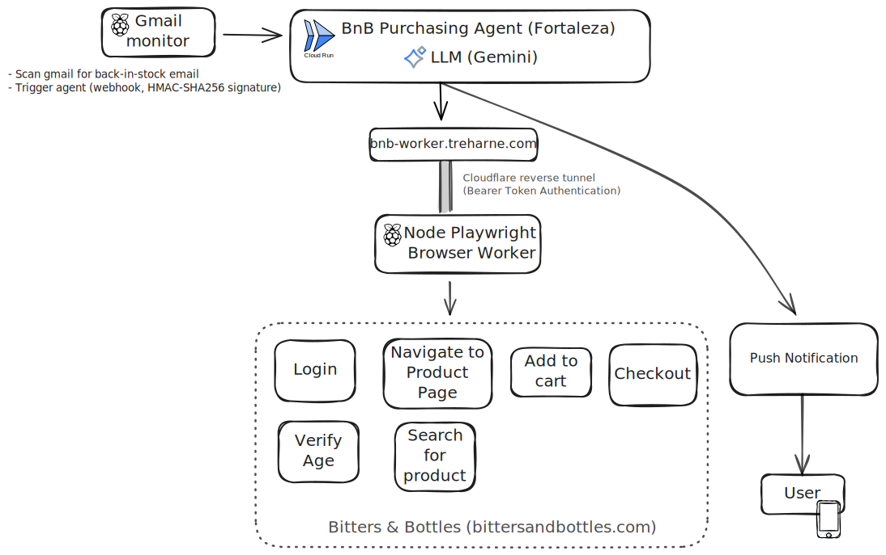

# Bitters & Bottles Purchase Agent

An AI agent that automatically purchases products from Bitters & Bottles Spirit Shop when notified via email.

**Capstone Project: Kaggle x Google 5-Day AI Agents Intensive Course**

## Architecture Overview

### System Components

1. **Gmail Monitor (Raspberry Pi)**
   - Continuously monitors Gmail for "Fortaleza in stock" notifications
   - Extracts direct purchase link from email
   - Sends signed webhook to Cloud Run with link

2. **Purchase Agent (Google ADK)** ⭐ Core Component
   - Orchestrates entire purchase workflow
   - Single agent with specialized tools
   - Deployed on GCP Cloud Run
   - Calls remote browser worker for automation

3. **Browser Worker (Node.js Playwright)**
   - Separate Node.js server running Playwright
   - Hosted at bnb-worker.treharne.com
   - Accessed via Cloudflare reverse tunnel
   - Isolated from Cloud Run to avoid bot detection

4. **Secret Storage (GCP Secret Manager)**
   - Secure credential storage
   - Payment information
   - Account credentials

5. **Notifications (Pushover)**
   - Real-time status updates
   - Success/failure alerts
   - Human approval requests (interactive)



### Agent Tools

- `navigate_to_product`: Navigates to product using direct link (with fallback to search)
- `verify_age`: Handles age verification prompts (called opportunistically)
- `login_to_account`: Authenticates with B&B account
- `add_to_cart`: Adds product to shopping cart
- `checkout_and_pay`: Completes purchase with pickup option

### Workflow

**Primary Flow (Happy Path):**
```
Gmail Alert → Pi Webhook (direct_link) → Cloud Run Agent →
  [Agent calls Browser Worker at bnb-worker.treharne.com for all browser operations:]
    Login → Navigate to direct_link → Verify Age (if modal) →
      Add to Cart → Checkout → Human Approval (Pushover) →
        Submit Order → Success Notification
```

**Error Fallback Flow:**
```
If direct_link fails (protocol error, 404, wrong page):
  Login → Navigate to homepage → Search for "Fortaleza" →
    Select product → Add to Cart → Checkout →
      Human Approval → Submit Order → Success Notification
```

**Key Flow Details:**
- Cloud Run agent receives webhook and orchestrates the workflow
- All browser automation executed remotely on bnb-worker.treharne.com via Cloudflare tunnel
- Login happens first to establish session
- Direct link from email is tried first (faster, more reliable)
- Age verification handled opportunistically (may appear at any navigation)
- If direct link fails, fallback to homepage → search → product selection
- Human approval required before purchase submission (interactive Pushover notification)
- Search is fallback only for link errors

## Why Native Playwright (Not MCP)?

**Native Playwright Approach:**
- ✅ Simpler deployment (single container)
- ✅ Lower latency (no network overhead)
- ✅ Better debugging (local headed mode)
- ✅ Full Playwright API control
- ✅ Easier state management
- ✅ Lower cost (one service)

**MCP would add:**
- ❌ Extra complexity (separate server)
- ❌ Network latency between agent and browser
- ❌ Additional infrastructure to manage
- ❌ More failure points

For this focused use case, native Playwright provides the best balance of simplicity and capability.

## Why Separate Browser Worker?

**Bot Detection Problem:**
- Bitters & Bottles website has bot detection measures
- Cloud Run IPs frequently flagged as suspicious
- Resulted in timeouts and failed purchases

**Solution: Isolated Browser Worker**
- Dedicated Node.js server running Playwright
- Hosted at bnb-worker.treharne.com
- Accessed via Cloudflare reverse tunnel
- Residential/stable IP avoids Cloud Run IP reputation issues
- Consistent browser fingerprint and session state

**Architecture:**
- Cloud Run agent orchestrates workflow and makes decisions
- Browser worker executes browser automation tools remotely
- Agent calls worker APIs for each tool (login, navigate, add to cart, checkout)
- Worker maintains browser session and cookies between calls

**Trade-offs:**
- ➕ Avoids bot detection (critical for success)
- ➕ Stable browser environment with persistent cookies
- ➕ Can run headed browser for debugging if needed
- ➖ Additional infrastructure (separate worker server)
- ➖ Network latency between agent and browser (acceptable for this use case)

## Security Architecture

### Webhook Security (Pi → Cloud Run)
- HMAC-SHA256 signed requests
- Timestamp validation (5-minute window)
- Constant-time signature comparison
- Event ID deduplication prevents replay attacks

### Browser Worker Authentication (Cloud Run → Pi)
The browser worker runs on the Raspberry Pi and is exposed via Cloudflare tunnel at bnb-worker.treharne.com. Access is protected by:

- **Bearer Token Authentication**: All requests require `Authorization: Bearer <token>` header
- **Token Strength Validation**: Minimum 32 characters enforced at startup
- **Production Requirement**: Server refuses to start in production without valid token
- **Rate Limiting**: 5 requests per 15 minutes per IP address
- **Health Check Exception**: `/health` endpoint is public for monitoring

**Security Model**:
- Token stored in GCP Secret Manager as `browser_worker_auth_token`
- Same token set as `WORKER_AUTH_TOKEN` environment variable on Pi
- Without valid token, all browser automation endpoints return 401 Unauthorized
- Even if the public URL is discovered, no operations can be performed without the token

**Token Distribution**:
```python
# Cloud Run retrieves from Secret Manager
token = SecretManager.get_secret("browser_worker_auth_token")

# Sends as Bearer token
headers = {"Authorization": f"Bearer {token}"}
```

### Credential Management
- All secrets in GCP Secret Manager
- No secrets in code or logs
- Runtime-only in-memory access
- Redaction in all log output

### Payment Security
- Card data never logged
- Secure form filling only
- No persistence of payment info
- HTTPS-only communication

## Operating Modes

### `dryrun`
- Full navigation and form filling
- Stops before final purchase
- Safe for testing selectors

### `test`
- Real purchase of any product
- End-to-end validation with actual order submission
- Use for testing the full flow or purchasing any product

### `prod`
- Real Fortaleza purchase
- Requires `CONFIRM_PROD=YES`
- Product name assertions

## Prerequisites

- Python 3.13.7 (or 3.12.x)
- Docker
- GCP account with billing enabled
- gcloud CLI configured
- Pushover account

## Local Development Setup

### 1. Clone and Setup

```bash
cd /Users/mceciliatreharne/source/cvtreharne/fortaleza-purchase-agent
python3 -m venv venv
source venv/bin/activate
pip install -r requirements.txt
playwright install chromium
```

### 2. Environment Configuration

Create `.env.local`:

```bash
# Mode
MODE=dryrun
HEADLESS=false
CONFIRM_PROD=NO

# Product
PRODUCT_NAME=Fortaleza
PRODUCT_URL=

# GCP (for local testing with Secret Manager)
GCP_PROJECT_ID=your-project-id
GCP_REGION=us-central1

# Local secrets (development only - DO NOT COMMIT)
BNB_EMAIL=your@email.com
BNB_PASSWORD=your_password
CC_NUMBER=
CC_EXP_MONTH=
CC_EXP_YEAR=
CC_CVV=
BILLING_NAME=
BILLING_ADDRESS1=
BILLING_CITY=
BILLING_STATE=
BILLING_ZIP=
PUSHOVER_APP_TOKEN=
PUSHOVER_USER_KEY=
PI_WEBHOOK_SHARED_SECRET=
```

### 3. Run Locally

```bash
# Start FastAPI server
python -m uvicorn src.app.main:app --reload --port 8080

# In another terminal, trigger a run
curl -X POST http://localhost:8080/webhook/pi \
  -H "Content-Type: application/json" \
  -H "X-Timestamp: $(date +%s)" \
  -H "X-Signature: <compute HMAC>" \
  -d '{
    "event_id": "test-1", 
    "received_at": "2025-11-16T00:00:00Z", 
    "subject": "Fortaleza Back in Stock",
    "direct_link": "https://www.bittersandbottles.com/products/fortaleza-blanco",
    "product_hint": "Fortaleza"
  }'
```

### 4. Debug with Playwright Inspector

```bash
PWDEBUG=1 HEADLESS=false python -m src.app.main
```

### 5. Using Debug Scripts for Development

The `scripts/` directory contains debug scripts for testing individual tools in isolation. These are invaluable for development and troubleshooting.

#### Available Debug Scripts

**`scripts/debug_login.py`** - Test login functionality
```bash
HEADLESS=false python scripts/debug_login.py
```
Use when:
- Testing login after modifying `login.py`
- Debugging authentication failures
- Verifying age verification works correctly
- Checking cookie persistence

**`scripts/debug_cart.py`** - Test add-to-cart functionality
```bash
HEADLESS=false python scripts/debug_cart.py
```
Use when:
- Testing cart operations after modifying `cart.py`
- Debugging "Add to Cart" button detection
- Verifying cart drawer appearance
- Testing sold-out product handling

**`scripts/debug_checkout.py`** - Test checkout flow (DRYRUN)
```bash
HEADLESS=false python scripts/debug_checkout.py
```
Use when:
- Testing checkout after modifying `checkout.py`
- Debugging payment form filling issues
- Verifying order summary extraction
- Testing pickup location detection
- **Note**: Runs in dryrun mode, will NOT submit orders

**`scripts/debug_order_summary.py`** - Inspect order summary DOM
```bash
HEADLESS=false python scripts/debug_order_summary.py
```
Use when:
- Order summary extraction returns "unknown" values
- Website structure changes break selectors
- Need to find new CSS selectors for price elements
- **Output**: Detailed DOM structure analysis

**`scripts/debug_search.py`** - Test search functionality
```bash
HEADLESS=false python scripts/debug_search.py
```
Use when:
- Testing search after modifying `navigate.py`
- Debugging search suggestion dropdown
- Verifying product link detection
- Investigating search result page changes

#### Debug Script Best Practices

1. **Always run with `HEADLESS=false`** to see what's happening
2. **Check screenshots** - All debug scripts save screenshots on success/error
3. **Update test URLs** - If test products become unavailable, update the `TEST_PRODUCT_URL` constants
4. **Use for development** - These scripts are not automated tests, they're for manual inspection
5. **Keep credentials safe** - Debug scripts use `.env.local`, never commit this file

#### Example: Debugging Order Summary Extraction

If order summary extraction breaks:
```bash
# 1. Run the diagnostic script
HEADLESS=false python scripts/debug_order_summary.py

# 2. Review the console output for DOM structure
# 3. Look for parent/grandparent relationships in the output
# 4. Update selectors in src/tools/checkout.py _get_order_summary()
# 5. Re-run to verify the fix
```

## GCP Deployment

**Note:** This deployment guide covers the Cloud Run agent only. The browser worker (bnb-worker.treharne.com) is deployed separately as a Node.js service and accessed via Cloudflare tunnel.

### 1. Create GCP Project

```bash
gcloud projects create fortaleza-agent-prod
gcloud config set project fortaleza-agent-prod
gcloud alpha billing projects link fortaleza-agent-prod --billing-account=YOUR_BILLING_ACCOUNT
```

### 2. Enable Required APIs

```bash
gcloud services enable \
  run.googleapis.com \
  secretmanager.googleapis.com \
  artifactregistry.googleapis.com \
  logging.googleapis.com \
  aiplatform.googleapis.com
```

### 3. Create Artifact Registry

```bash
gcloud artifacts repositories create agents \
  --repository-format=docker \
  --location=us-central1

gcloud auth configure-docker us-central1-docker.pkg.dev
```

### 4. Create Service Account

```bash
gcloud iam service-accounts create fortaleza-agent-sa \
  --display-name="Fortaleza Purchase Agent"

# Grant necessary roles
gcloud projects add-iam-policy-binding fortaleza-agent-prod \
  --member="serviceAccount:fortaleza-agent-sa@fortaleza-agent-prod.iam.gserviceaccount.com" \
  --role="roles/secretmanager.secretAccessor"

gcloud projects add-iam-policy-binding fortaleza-agent-prod \
  --member="serviceAccount:fortaleza-agent-sa@fortaleza-agent-prod.iam.gserviceaccount.com" \
  --role="roles/logging.logWriter"
```

### 5. Create Secrets

```bash
# Use the provided script
./scripts/setup_secrets.sh
```

### 6. Build and Deploy

```bash
# Build container
docker build -t us-central1-docker.pkg.dev/fortaleza-agent-prod/agents/fortaleza:latest .

# Push to registry
docker push us-central1-docker.pkg.dev/fortaleza-agent-prod/agents/fortaleza:latest

# Deploy to Cloud Run
gcloud run deploy fortaleza-agent \
  --image us-central1-docker.pkg.dev/fortaleza-agent-prod/agents/fortaleza:latest \
  --service-account fortaleza-agent-sa@fortaleza-agent-prod.iam.gserviceaccount.com \
  --region us-central1 \
  --platform managed \
  --no-allow-unauthenticated \
  --min-instances 0 \
  --max-instances 1 \
  --cpu 1 \
  --memory 1Gi \
  --timeout 540 \
  --set-env-vars MODE=prod,CONFIRM_PROD=YES,HEADLESS=true,GCP_PROJECT_ID=fortaleza-agent-prod
```

### 7. Update Raspberry Pi Script

Update your Pi's `gmail_fortaleza_monitor.py` to call the Cloud Run webhook endpoint. See `scripts/pi_integration_example.py` for implementation.

## Testing Strategy

### Phase 1: Local Dry Run
```bash
MODE=dryrun HEADLESS=false python -m src.app.main
```

### Phase 2: Local Test Purchase
```bash
MODE=test PRODUCT_NAME="In Stock Test Product" python -m src.app.main
```

### Phase 3: Cloud Run Dry Run
Deploy with `MODE=dryrun` and test webhook

### Phase 4: Cloud Run Test Purchase
Deploy with `MODE=test` and validate end-to-end

### Phase 5: Production Ready
Deploy with `MODE=prod` and `CONFIRM_PROD=YES`

## Monitoring & Observability

### Cloud Logging Queries

```
# All agent runs
resource.type="cloud_run_revision"
resource.labels.service_name="fortaleza-agent"

# Specific run
jsonPayload.run_id="abc-123"

# Failures only
jsonPayload.level="ERROR"
```

### Pushover Notifications

- **START**: Agent begins processing
- **SUCCESS**: Purchase completed
- **FAILURE**: Error occurred (includes details)
- **HUMAN-ASSIST-NEEDED**: Manual intervention required (2FA, CAPTCHA, 3DS)

## Error Handling

### Automatic Retries
- Transient network errors
- Element not ready
- Temporary page load issues

### Fallback Strategies
- Direct link fails → Homepage + login + search
- Cart drawer missing → Direct cart page
- Protocol error (trk.bittersandbottles.com) → Search fallback

### Manual Intervention Required
- Two-factor authentication
- CAPTCHA challenges
- 3D Secure payment verification
- Out of stock (no retry)

## Operational Runbook

### Scenario: Protocol Error from Email Link
**Symptom**: trk.bittersandbottles.com redirect fails  
**Action**: Agent automatically falls back to homepage + search  
**Monitoring**: Check logs for "fallback to search" message

### Scenario: Product Sold Out During Checkout
**Symptom**: "Sold out" detected after add to cart  
**Action**: Agent aborts, sends notification  
**Monitoring**: No retry until new email event

### Scenario: 3DS Challenge Appears
**Symptom**: Payment requires additional verification  
**Action**: Agent sends HUMAN-ASSIST-NEEDED and pauses  
**Monitoring**: Manual completion required

### Scenario: Duplicate Webhook Triggers
**Symptom**: Multiple identical event_ids  
**Action**: Idempotency layer blocks duplicates  
**Monitoring**: Check for "duplicate event" log entries

## Project Structure

```
fortaleza-purchase-agent/
├── src/
│   ├── app/
│   │   ├── __init__.py
│   │   ├── main.py              # FastAPI app
│   │   └── webhook.py           # Webhook endpoint
│   ├── agent/
│   │   ├── __init__.py
│   │   └── orchestrator.py      # ADK agent
│   ├── tools/
│   │   ├── __init__.py
│   │   ├── navigate.py          # Navigate with fallback
│   │   ├── verify_age.py        # Age verification
│   │   ├── login.py             # Account login
│   │   ├── cart.py              # Add to cart
│   │   └── checkout.py          # Checkout and pay
│   └── core/
│       ├── __init__.py
│       ├── config.py            # Settings
│       ├── secrets.py           # Secret Manager
│       ├── logging.py           # Structured logging
│       ├── notify.py            # Pushover
│       ├── browser.py           # Playwright harness
│       ├── errors.py            # Custom exceptions
│       └── utils.py
├── tests/
│   ├── test_tools.py
│   └── test_integration.py
├── scripts/
│   ├── deploy.sh
│   ├── setup_secrets.sh
│   ├── run_local.sh
│   └── pi_integration_example.py
├── Dockerfile
├── requirements.txt
├── .env.local
├── .gitignore
└── README.md
```

## Limitations & Known Issues

- **Site changes**: B&B may update their website, requiring selector updates
- **Anti-bot measures**: Captchas or rate limiting may require human intervention
- **Stock detection**: Agent only runs when triggered by email
- **Single instance**: max-instances=1 prevents parallel purchases
- **Payment methods**: Only supports credit card, not digital wallets
- **Direct link timing**: Email link may expire or change format

## Contributing

This is a capstone project. After course completion, contributions for generalization are welcome.

## License

MIT

## Disclaimer

Educational project for learning Google ADK. Use responsibly. Always verify purchases. Not responsible for unintended transactions.

## Acknowledgments

- Kaggle x Google 5-Day AI Agents Intensive Course
- Google ADK team
- Playwright maintainers
- The pursuit of fine tequila 🥃
